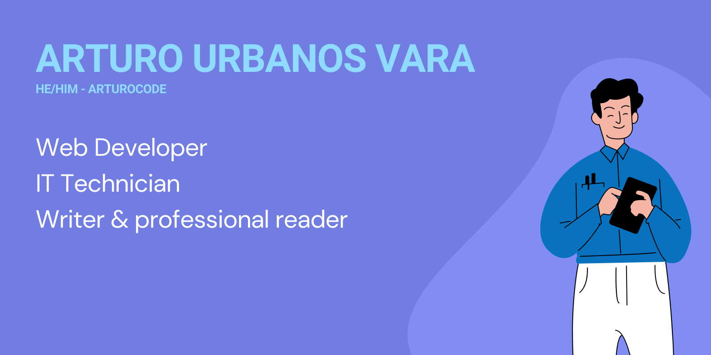

## Hi, I'm Arturo 

📜 I’m currently studying my final year of Web Development. I have also attended courses of technology platforms such as OpenWebinars and Platzi. In addition, I'm a IT Technician and have worked in AlcalaBC and Serconi offering IT advice and technical support. 

### 🔧 Technologies & Tools

<table border="0">
     <tr>
          <td>
               
               
          </td>
     </tr>
     <tr>
          <td>
               
               
               
               
               
               
          </td>
     </tr>
     <tr>
          <td>
               
               
               
               
          </td>
     </tr>
</table>

🌱 I use languages like JavaScript, PHP, HTML, CSS and framweorks like Symfony and now I'm currently learning some new programming lenguages and frameworks such as React, Angular & Vue before doing my work internship.

⚡ Fun fact: I'm a writer & professional reader. I have published several novels and short stories, so I can help other writers and, in general, people who work in the publishing industry in their projects (websites, applications...)

😄 Pronouns: he / him

## Find me around the web 🌎

For more information about me and my projects, check out <a href="http://arturocode.github.io">arturocode.github.io</a>.

📫 You can contact me at arturocodedev@gmail.com. 

I'm on social media too 📱

https://github-readme-stats.vercel.app/api/top-langs/?username={arturocode}&theme=blue-green
     
     
###### Credits

<a target="_blank" href="https://icons8.com/icon/xWVjuc9hryql/twitter">Twitter</a> icon by <a target="_blank" href="https://icons8.com">Icons8</a>

<a target="_blank" href="https://icons8.com/icon/TEYr8ETaIfBJ/instagram">Instagram</a> icon by <a target="_blank" href="https://icons8.com">Icons8</a>

<a target="_blank" href="https://icons8.com/icon/108812/linkedin">LinkedIn</a> icon by <a target="_blank" href="https://icons8.com">Icons8</a>

<!--
**ArturoCode/arturocode** is a ✨ _special_ ✨ repository because its `README.md` (this file) appears on your GitHub profile.

Here are some ideas to get you started:

- 🔭 I’m currently working on ...
- 🌱 I’m currently learning ...
- 👯 I’m looking to collaborate on ...
- 🤔 I’m looking for help with ...
- 💬 Ask me about ...
- 📫 How to reach me: ...
- 😄 Pronouns: ...
- ⚡ Fun fact: ...
-->
