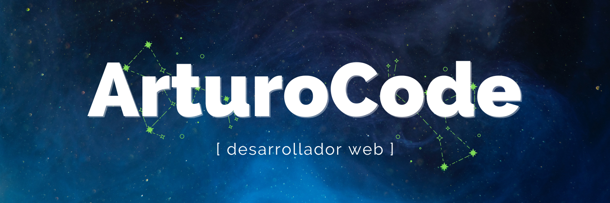

## 
Hola, soy Arturo 

[English Version](https://github.com/ArturoCode/ArturoCode/blob/main/README-EN.md)

📜 Estoy terminando mi último año del Grado Superior de Desarrollo de Aplicaciones Web haciendo prácticas como desarollador web en Acevedo y he complementado mis estudios con cursos de plataformas de tecnología como OpenWebinars, Platzi o Crehana, entre otras. Además, soy Técnico de Sistemas y Redes y he trabajado en empresas como AlcalaBC y Serconi en puestos de consultoría informática y soporte técnico.

🌱 Uso lenguajes y código como JavaScript, PHP, SQL, HTML, CSS, y frameworks como Bootstrap y Symfony. Actualmente estoy aprendiendo otros lenguajes de programación como Python y TypeScript y otros frameworks como React y Angular.

🌍 Vivo actualmente en Madrid.

⚡ Puedes ver mi portfolio / CV [aquí](http://arturocode.github.io/cv-online) o en [LinkedIn](https://www.linkedin.com/in/arturo-urbanos-vara).

✉️  O contactarme a través de correo electrónico en [arturocodedev@gmail.com](mailto:arturocodedev@gmail.com). 

🤝  Estoy abierto a colaborar en diferentes proyectos.

📚  Fun Fact: He publicado novela, relato y ensayo y he trabajado con editoriales y autores, así que puedo desarrollar y ayudar a cualquier persona que trabaje en la industria literaria con sus proyectos (webs, blogs, otro tipo de aplicaciones...).

<table border="0">
     <tr>
          <td align="center">
               
               
               
               
               
          </td>
     </tr>
     <tr>
          <td align="center">
               
               
               
               
               
               
          </td>
     </tr>
      <tr>
          <td align="center">
               
               
               
               
               
          </td>
     </tr>
     <tr>
          <td align="center">
               
               
               
               
          </td>
    </tr>
    <tr>
          <td align="center">
            
            
            
            
          </td>
     </tr>
</table>

## Encuéntrame en la Web 🌎

Para más información sobre mí y mis proyectos, puedes visitar [mi web.](https://arturocode.super.site/) 

¡También estoy en redes sociales! 📱

  

#### Stats

        
###### Credits

Foto de perfil de makowwka.
